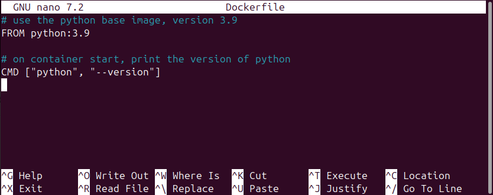

:::::::::::::::::::::::::::::::::::::: questions 

- How do you create new Docker images?

::::::::::::::::::::::::::::::::::::::::::::::::

::::::::::::::::::::::::::::::::::::: objectives

- Explain how a Dockerfile is used to create Docker images
- Create a Dockerfile to run a command
- Use `docker build` to create a new image
- Update a Dockerfile to run a Python script

::::::::::::::::::::::::::::::::::::::::::::::::

:::::::::::::::::::::::::::::::::::::::::::::::::::::::::::::::::::: instructor

**TODO** Anything instructors should be aware of for this episode?

::::::::::::::::::::::::::::::::::::::::::::::::::::::::::::::::::::::::::::::::

## Introduction

In the previous episode, we used a Docker image to run a Docker container. We 
briefly covered how images are used to make a container, but where does the 
Docker image come from? In this episode, we will create and use Dockerfiles to 
make a new _image_, and use that image to start a Docker container.

**TODO** Might be a good spot for a visual.

## Dockerfiles

A Dockerfile is a plain text file that includes instructions for making a 
Docker image. Dockerfiles can be very short or very long, depending on how 
complicated the Docker image is going to be. A minimal Dockerfile would have 
two pieces of information:

1. The base image to start from, and
2. What to do when the container starts running

The first point (the base image) may seem a little odd, as it appears we are 
actually building an image from...another image? And that is exactly what we 
are doing!

::::::::::::::::::::::::::::::::::::: callout

It is possible for you to start from an operating system image (e.g. from an 
ISO file), but there are _a lot_ of Docker images already available for 
whichever operating system you want to use. But let us not make even more work 
for ourselves. It's turtles all the way down and that's OK.

::::::::::::::::::::::::::::::::::::::::::::::::

### Dockerfile gross anatomy

The general structure of a Dockerfile is a series of keywords followed by some
information. For the minimal Dockerfile we are going to build, we need to 
include commands to accomplish the two points we mentioned above (identify the 
base image and do something when the container starts):

1. The `FROM` command is followed by the name of the image to start from and 
the version number of that image. When we use the Dockerfile to build the 
Docker image, our computer will start by downloading a copy of that base image, 
and adding to based on whatever subsequent commands we provide in the 
Dockerfile.
2. The `CMD` command tells the container what to do when it starts running. In 
some cases, it will start an application, like we saw with the OpenRefine image 
in the previous episode. The `CMD` command can also do things like run analyses 
based on data passed to the container.

For this episode, we will start by creating a Dockerfile with only these two 
commands:

```
FROM python:3.9
CMD ["python", "--version"]
```

**TODO**: Where do we want to be making this file? Is the home directory OK?

### Creating Dockerfiles

As mentioned above, Dockerfile are plain text files, so we need to use a text 
editor to create them. In the virtual machine where we are working, the nano 
text editor will work for us. To create the Dockerfile, start by opening up the 
command line terminal again (or opening a new tab if the terminal is already 
running) and running the following:

```
nano Dockerfile
```

This command will do two things: first, it creates an empty text file called 
"Dockerfile" and, second, it opens the file in the nano text editor. We will 
add those two lines, as well as a comment for each line. Comments are useful 
for anyone who will need to look at the Dockerfile in the future (this usually 
means you!). The comment character, `#`, tells the computer to ignore any text 
that comes to the right of the `#`, as it is for human eyes only. These 
comments are not necessary to build the image, but they are a *very* good 
practice to get into. In the nano text editor, add the following:

```
FROM python:3.9  # use the python base image, version 3.9
CMD ["python", "--version"]  # on container start, print the version of python
```

Which should look something like this in your terminal:

{alt='terminal window showing contents of Dockerfile in nano editor'}

Once you have that typed in, you can save and close the file. To do this, first
hold down the Control/Command key and press the letter "O" key (this is often 
written as `^O`) and press "Enter" to confirm the save to the file called 
"Dockerfile". Second, to exit the nano editor, hold down the Control/Command 
key and press the letter "X" key (`^X`). If you are curious about what was 
saved to the Dockerfile, you can run the command `cat Dockerfile` on the 
terminal command line and it will print the contents of the file to the screen.

### Creating images from Dockerfiles

We have now created the Dockerfile, and there is one last step necessary to 
make the Docker image from that Dockerfile. To make the Docker image, we use 
the `docker build` command and provide it with the name of the image. In the 
terminal command line, run the following command:

```
docker build -t vboxuser/python-test .
```

Breaking down the command into the component parts:

- `docker build` is the base command telling our computer to build a Docker 
image
- `-t` indicates we are going to "tag" this image with a label
- `vboxuser/python-test` provides the name of the repository (`vboxuser`) and 
the name of the image (`python-test`). This convention, using the repository 
name and the image name, is like using a person's full name (family name and 
given name), rather than just someone's given name. Just using an image name 
alone, without a repository name, would be like referring to "Mohamed" or 
"Maria" and expecting other people to know exactly who you are referring to.
- `.` is just a dot telling your computer where the Dockerfile is located. In 
the command line interface, the dot is directory where you are running the 
command. (**TODO**: Might be a good spot to link the LC Shell lesson here.) If 
the Dockerfile was somewhere other than the folder your command line terminal 
is currently running in, you would replace the dot with that location. For 
example, if the Dockerfile was located on the Desktop, we would update our 
command to `docker build -t vboxuser/python-text ~/Desktop` (where the dot `.` 
is replaced with `~/Desktop`).

::::::::::::::::::::::::::::::::::::: callout

If you are doing these steps on your local machine, rather than on a Virtual 
Machine, you would replace the name of the repository (`vboxuser`) with your 
username for the machine you are using.

::::::::::::::::::::::::::::::::::::::::::::::::

When you run the `docker build` command, it will create a new image for use on 
the machine. 

**TODO**: Add screenshot of what the command line output looks like when 
running `docker build`.

You can see all the images you have available for use by running 
the following in the command line terminal:

```
docker image ls
```

Note we see the image for OpenRefine that we downloaded in the previous 
episode, along with the new image we just created, python-test.

**TODO**: Add image of what the output of `docker image ls` would look like.

::::::::::::::::::::::::::::::::::::: challenge 

## Challenge 1: Updating our analogy

In the previous episode, a couple of different analogies were introduced to 
explain the relationship between a Docker image and a Docker container. Pick 
one of those analogies and update it to also include the Dockerfile.

:::::::::::::::::::::::: solution 

- To use an analogy from architecture, Dockerfiles are a file with blueprints,
images are the *rendered or printed* blueprints, and containers are the actual 
building.
- An image is a recipe, say, for your favorite curry, while the container is 
the actual curry dish you can eat. In this analogy, a Dockerfile might just be 
a list of ingredients and the general concept of a curry. Granted, some of 
these analogies can only go so far.
- "Think of a container as a shipping container for software - it holds 
important content like files and programs so that an application can be 
delivered efficiently from producer to consumer. An image is more like a 
read-only manifest or schematic of what will be inside the container."
(from [Jacob Schmitt](https://circleci.com/blog/docker-image-vs-container/)). 
In this case, the Dockerfile could be a template that one uses to create the 
manifest or schematic.
- If you are familiar with object-oriented programming, you can think of a 
Dockerfile as an abstract superclass, an image as a class, and a container an 
object of that class. 

:::::::::::::::::::::::::::::::::
::::::::::::::::::::::::::::::::::::::::::::::::

### Starting containers

Now that we have built the image, we want to use it! We are going to use the 
same commands to start a container as we did in the previous episode. We start 
by using the image to run a container with the `docker run` command, passing 
also the name of the image to use. Run the following into the command line 
terminal:

```
docker run vboxuser/python-test
```

Make sure the last part (`vboxuser/python-test`) matches the same repository/
image combination you used when you ran the `docker build` command. 

::::::::::::::::::::::::::::::::::::: callout

You may notice something missing from the last time we ran `docker run`. Recall 
that to start the OpenRefine container, we ran:

```
docker run -p 3333:3333 felixlohmeier/openrefine
```

This time, we omitted the information about ports (the `-p 3333:3333` part) 
because the python-test image does not need a way to exchange information 
between the container and the computer that is running the container (in this 
case, the Virtual Machine).

::::::::::::::::::::::::::::::::::::::::::::::::

Our container is not designed to do a lot - it should only start up, run the 
command to print the version of Python that is installed on the container, and 
then stop the container. After issuing the `docker run` command, we should see 

**TODO** Screenshot of output of `docker run` for python-test.

We can now check the status of our images with the `docker ps` command. Since 
we want to list both running containers and stopped containers, we need to also 
use the "all" option. Run the following in the terminal command line:

```
docker ps -a
```

**TODO** Screenshot of output of `docker ps`


::::::::::::::::::::::::::::::::::::: challenge 

## Challenge 2: Update base image

- Update the Dockerfile to have a base image that includes Python version 3.12 
(instead of Python version 3.9)
- Build the image
- Start the container to confirm it is using Python version 3.12

:::::::::::::::::::::::: solution 

### Update the Dockerfile

To change the base image, update the information passed to the `FROM` command. 
That is, open the Dockerfile and change this line:

`FROM python:3.9`

to 

`FROM python:3.12`

Remember to open the file in a text editor, you can type the following in the 
terminal command line:

```
nano Dockerfile
```

To save your changes, hold down the control key and press the letter "O" key 
(^O). To exit the nano text editor, use ^X (Control-X).

### Buid the image

In the terminal, use `docker build` to create a new version of the image. 

```
docker build -t vboxuser/python-test
```

This command will over-write the previous version of the image. **TODO** Need 
to test this statement.

### Verify image was updated

In the terminal, use `docker run` to start a container based on the updated 
image.

```
docker run vboxuser/python-test
```

You can confirm that the container has stopped running by printing the status 
of all containers with the `docker ps` command:

```
docker ps -a
```

:::::::::::::::::::::::::::::::::
::::::::::::::::::::::::::::::::::::::::::::::::

### Copying files into the image

**TODO** Add flavor text about why we might do this.

`COPY ...`

See 
https://stackoverflow.com/questions/32727594/how-to-pass-arguments-to-shell-script-through-docker-run
and
https://www.tutorialspoint.com/how-to-pass-command-line-arguments-to-a-python-docker-container

for example of passing arguments to a script. Passing arguments might be too 
much.

::::::::::::::::::::::::::::::::::::: challenge 

## Challenge 3: Copy a script to run in the container

There is a script (make this a `print("Hello World!")` python script) you want 
to include 

:::::::::::::::::::::::: solution 

**TODO**: Insert solution
:::::::::::::::::::::::::::::::::
::::::::::::::::::::::::::::::::::::::::::::::::


::::::::::::::::::::::::::::::::::::: keypoints 

- Dockerfiles include instructions for creating a Docker image
- The `FROM` command in a Dockerfile indicates the base image to build on
- The `CMD` command in a Dockerfile includes commands to execute when a 
container starts running
- The `COPY` command in a Dockerfile copies files from your local machine to 
the Docker image so they are available for use when the container is running

::::::::::::::::::::::::::::::::::::::::::::::::
