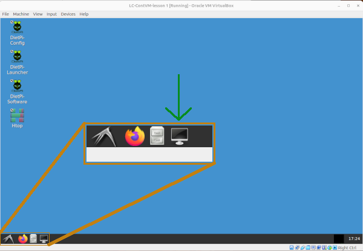
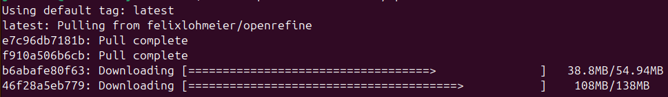
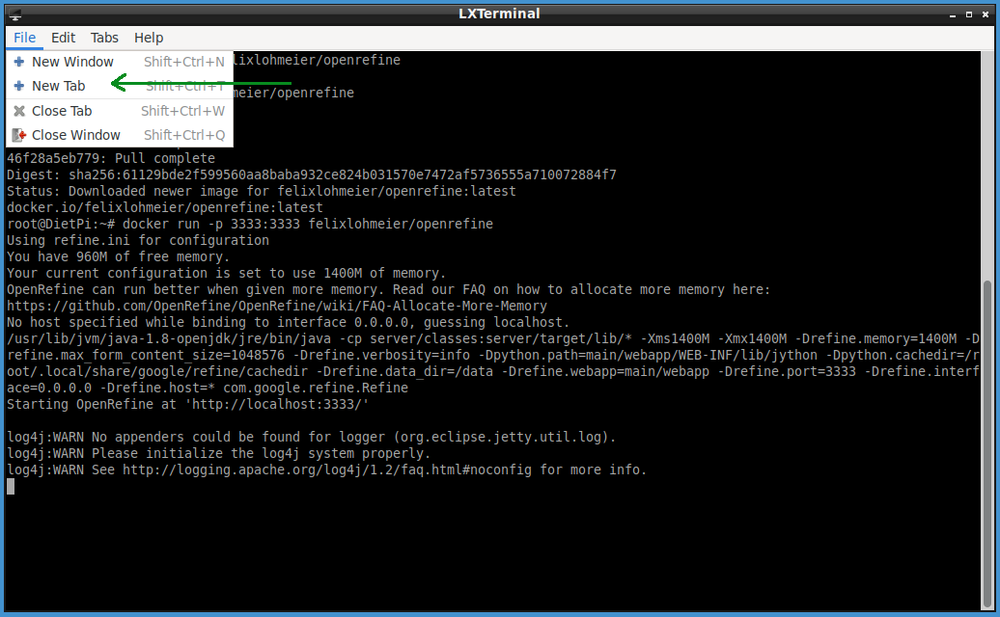
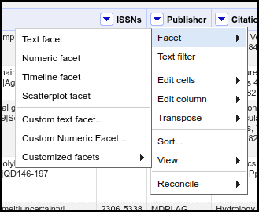
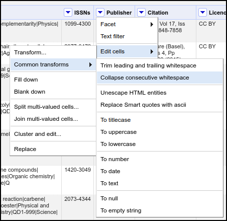

:::::::::::::::::::::::::::::::::::::: questions 

- What is a Docker image?
- What is a Docker container?
- How do you start and stop a container?
- How do retrieve output from a container to a local machine?

::::::::::::::::::::::::::::::::::::::::::::::::

::::::::::::::::::::::::::::::::::::: objectives

- Explain the difference between a Docker image and a Docker container
- Retrieve a Docker image from the cloud
- Start a Docker container running on a local machine
- Use the command line to check the status of the container
- Clean the environment by stopping the container

::::::::::::::::::::::::::::::::::::::::::::::::

## Introduction

Containers, like virtual machines, allow us to effectively simulate running 
*another* computer within our own machine. Why would we want to go through this 
process of running one computer within another. A few situations where 
containers are especially useful are:

1. You want to use software that is incompatible with the operating system on 
your machine.
2. You want to use a program that has lots of dependencies, which you do not 
want to manage.
3. You want to run analyses on a new set of data with identical settings as a 
prior study.

:::::::::::::::::::::::::::::::::::::::::::::::::::::::::::::::::::: instructor

Instructors should feel free to add their own examples in the introduction, to 
help your learners appreciate the utility of containers. Providing your own use 
case of containers helps lend authenticity to the lesson.

::::::::::::::::::::::::::::::::::::::::::::::::::::::::::::::::::::::::::::::::

### Images versus containers

There are two big pieces of the container world: images and containers. They 
are related to one another, but they are not synonymous. Briefly, images 
provide the plans for making a container, and a container is similar to a 
virtual machine in that it is effectively _another_ computer running on your 
computer. To use an analogy from architecture, images are the blueprints and 
containers are the actual building.

::::::::::::::::::::::::::::::::::::: callout

If you are a fan of philosophy, images are for Platonists and containers are 
for nominalists.

::::::::::::::::::::::::::::::::::::::::::::::::

Considering the differences between images and containers...

#### Images are

1. Read-only
2. Contain instructions (in a file called a "Dockerfile" - we talk about 
Dockerfiles later in the lesson)
3. They do not actually "do" anything

#### Containers are

1. Modifiable (while running)
2. Can include files and programs (like your computer!)
3. Can run analyses or web applications (and more)

::::::::::::::::::::::::::::::::::::: challenge 

## Challenge 1: Images versus containers

You instructor introduced one analogy for explaining the difference between a 
Docker image and a Docker container. What is another way to explain images and 
containers?

:::::::::::::::::::::::: solution 

Several analogies exist, and here are a few:

- An image is a recipe, say, for your favorite curry, while the container is 
the actual curry dish you can eat.
- "Think of a container as a shipping container for software - it holds 
important content like files and programs so that an application can be 
delivered efficiently from producer to consumer. An image is more like a 
read-only manifest or schematic of what will be inside the container."
(from [Jacob Schmitt](https://circleci.com/blog/docker-image-vs-container/))
- If you are familiar with object-oriented programming, you can think of an 
image as a class, and a container an object of that class. 

:::::::::::::::::::::::::::::::::
::::::::::::::::::::::::::::::::::::::::::::::::

### Working with containers

One thing to note right away is that a lot of the work of running containers 
happens through the command line interface. That is, we do not have a graphical 
user interface (GUI) with menus to work with. Instead, we type commands into a 
terminal for starting and stopping containers. 

For the purposes of this lesson, we are going to use a relatively lightweight 
workflow of using a container. Briefly, the steps of using a container are:

1. Retrieve the image we would like to use from an online repository.
2. Start the container running (like turning on a computer).
3. Interact with the container, if the container has such functionality (some 
containers are just programmed to run without additional interaction from 
users).
4. Check the status of the container.
5. Upon completion of whatever task we are using the container for, stop the 
container (like turning off the computer).

Steps 1, 2, 4, and 5 are all associated with a specific docker command:

1. Retrieve image: `docker pull`
2. Start container: `docker run`
3. 
4. Check status: `docker ps`
5. Stop container: `docker stop`

:::::::::::::::::::::::::::::::::::::::::::::::::::::::::::::::::::: instructor

The instructions included in the two episodes on containers assume that 
learners are using the virtual machines described in prior episodes. However, 
the following Docker instructions can all be run on any computer that has an 
internet connection and has [Docker installed](https://docs.docker.com/engine/install/). 
You can find more information about installing Docker at the Carpentries' 
[Containers](https://carpentries-incubator.github.io/docker-introduction/#software-to-install) 
lesson.

::::::::::::::::::::::::::::::::::::::::::::::::::::::::::::::::::::::::::::::::

#### Retrieving images

The first step of using containers is to download a copy of the image you would 
like to use. For Docker images, there are multiple sites on the internet that 
serve as sources for Docker images. Two common repositories are 
[DockerHub](https://hub.docker.com/) and 
[GitHub's Container Registry](https://docs.github.com/en/packages/working-with-a-github-packages-registry/working-with-the-container-registry); 
for this lesson, we will be downloading from DockerHub. The nice thing is that 
we do not have to open a web browser and manually download a file - instead we 
can use the Docker commands to do this for us. For downloading images, the 
syntax is:

```
docker pull <image creator>/<image name>
```

Where we replace `<image creator>` with the username of the person or 
organization responsible for the image and `<image name>` with the name of the 
image. For this lesson, we are going to use an image that includes the 
[OpenRefine](https://openrefine.org/) software. OpenRefine is a powerful 
data-wrangling tool that runs in a web browser.

::::::::::::::::::::::::::::::::::::: callout

Want to learn more about OpenRefine? Check out the Library Carpentry 
[Lesson on Open Refine](https://librarycarpentry.org/lc-open-refine/).

::::::::::::::::::::::::::::::::::::::::::::::::

To run this command (and all subsequent Docker commands), we will be using the 
command-line interface (CLI) in our virtual machines. Open the terminal window 
by clicking the computer screen icon in the lower-left corner of the virtual 
machine window. 

::::::::::::::::::::::::::::::::::::: callout

If you are not using a virtual machine, or if you are using a different virtual 
machine than the one introduced in previous episodes, you may need to open a 
command line terminal a different way. Searching for an application called 
"terminal" on most systems will tell you what the name of the program is to run 
a command line terminal.

::::::::::::::::::::::::::::::::::::::::::::::::

{alt='screenshot showing command line terminal icon location'}

Once the command line terminal is open, type the command to retrieve the 
OpenRefine image:

```
docker pull felixlohmeier/openrefine
```

After typing in the command, press "Enter" and Docker will download the image 
from DockerHub. You should see output that tracks the progress of the download.

{alt='terminal window showing downloading progress'}

:::::::::::::::::::::::::::::::: caution

Uh oh. If you tried to run the command above, you might have encountered an 
error like:

```
permission denied while trying to connect to the Docker daemon socket at unix://
/var/run/docker.sock: Get "http://%2Fvar%2Frun%2Fdocker.sock/v1.47/containers/js
on": dial unix /var/run/docker.sock: connect: permission denied
```

The reason this happens is that the docker program requires Administrator-level 
authorization to run. If the user does not have that level of access by 
default, the command above will be denied. We can get around this by adding the 
command `sudo` right before each call to `docker`. So, if you received the 
"permission denied" error, update the command to 

```
sudo docker pull felixlohmeier/openrefine
```

And press "Enter" to run the command. You will likely be asked for the user 
password. If you are running this in a virtual machine, it will be the same 
password you used to log in to the virtual machine. If you are running this on 
your own machine, you would use the password for your user account. Note for 
the remainder of this lesson, note you will _always_ need to add the `sudo` 
part whenever you call the `docker` command. There is another way to allow 
access to Docker commands without requiring the use of `sudo` and you can read 
about them at [https://docs.docker.com/engine/install/linux-postinstall/](https://docs.docker.com/engine/install/linux-postinstall/).

:::::::::::::::::::::::::::::::::::::::::::

::::::::::::::::::::::::::::::::::::: spoiler

##### DockerHub vs GitHub Container Registry

By default, the command `docker pull` will only look for images on DockerHub; 
if you want to download images from another source, such as the GitHub 
Container Registry (GHCR), you need to indicate this in the `docker pull` 
command. Specifically, we add the source information immediately before the 
`namespace` argument. So if we wanted to download the Docker image from the 
official [OpenRefine project on GitHub](https://github.com/OpenRefine), we 
would run

```
docker pull ghcr.io/openrefine/containers
```

where `ghcr.io` indicates the source of the image is the GHCR.

::::::::::::::::::::::::::::::::::::::::::::::::

#### Starting an image

You now have an image of a Docker container on your machine. This means, 
thinking back to our architecture analogy, you have the blueprints and now it 
is time to actually make the thing ("the thing" in this case being the 
running container on your machine). To start a container running from an image, 
we use the `docker run` command, passing the name of the image and any 
additional information. In our case, we will need to provide information on how 
we can interact with the container by setting the ports (we will see later how 
we use this information). In the command-line interface, run:

```
docker run -p 3333:3333 felixlohmeier/openrefine
```

Breaking down this command, there are three key parts:

1. `docker run`: tells docker to start running a new container
2. `-p 3333:3333`: tells docker we will use the local port 3333:3333 to 
communicate with the running container
3. `felixlohmeier/openrefine`: is the name of the image from which to build the 
container

There is a good chance you will see a variety of messages, including some 
warnings. However, these are not going to interfere with our lesson, so we will
ignore them for now. Remember, if (and only if) you receive the "permission 
denied" error message, you need to add `sudo` at the very beginning of the 
line.

::::::::::::::::::::::::::::::::::::: spoiler

The three warning messages you are likely to see are:

```
log4j:WARN No appenders could be found for logger (org.eclipse.jetty.util.log).
log4j:WARN Please initialize the log4j system properly.
log4j:WARN See http://logging.apache.org/log4j/1.2/faq.html#noconfig for more info.
```

These indicate that a logging system in the image is not configured the right 
way. We are not going to be looking at logs of the container, so we do not need 
to worry about these messages. If you end up building your own images, logging 
is likely to be an important part of your development and debugging process.

::::::::::::::::::::::::::::::::::::::::::::::::

#### Status check

At this point, our container is running. Or at least it should be. How can we 
check? In order to see which containers are running, we will use the `docker 
ps` command. Because the container we just started is running in the terminal 
window where we issued the `docker run` command, we will need to open a new 
terminal tab. We can do this in the terminal File menu, selecting the New 
Tab... option (File > New Tab...).

{alt='screenshot showing new tab option in terminal File menu'}

In this new terminal window, type the following and press "Enter":

```
docker ps
```

You should see a table print out in the terminal window. Note that if your 
windows are narrow, the output will wrap around the screen and be a little 
difficult (although not impossible) to read. If you find this is the case, you 
can make your terminal (and possibly your virtual machine) windows wider, then 
run the `docker ps` command again. The output should look something like:

```
$ docker ps
CONTAINER ID   IMAGE                      COMMAND                  CREATED         STATUS         PORTS                                       NAMES
e1e174015296   felixlohmeier/openrefine   "/app/refine -i 0.0.…"   9 seconds ago   Up 8 seconds   0.0.0.0:3333->3333/tcp, :::3333->3333/tcp   epic_nobel
$
```

Although the value in the first and last columns (CONTAINER ID and NAMES, 
respectively) will likely be different for everyone. The important columns to 
note are:

- `CONTAINER ID`: A unique identifier for this container. You can have multiple 
containers based on the same image running simultaneously, and they will all 
have different values for `CONTAINER ID`.
- `IMAGE`: The name of the image this container is based on.
- `STATUS`: This will indicate if a container is running (it will say something 
like `Up 5 minutes`, which means it started running 5 minutes ago) or if it has 
stopped running (the message will be `Exited (143) 7 seconds ago`).

So now we see that our container is running and we are ready to actually use 
the OpenRefine program.

#### Using the container

The first thing we need to do is download the sample data we are going to work 
with in OpenRefine. In a the web browser on the virtual machine, enter the URL 
[https://bit.ly/lc-article-data](https://bit.ly/lc-article-data). This should 
either download a CSV file or present you with a webpage of the CSV data. If 
the latter (you see a webpage of the data), download the data as a CSV file. 
Because you are working in the Virtual Machine, this download should happen 
within the VM. These data are 1,001 records of Open Access published articles.
Note the following instructions for using OpenRefine are adapted from the 
[Library Carpentry lesson on OpenRefine](https://librarycarpentry.github.io/lc-open-refine/).


::::::::::::::::::::::::::::::::::::: callout

Note if you are not using a virtual machine, the CSV file will install on your 
local machine.

::::::::::::::::::::::::::::::::::::::::::::::::

We now need to open OpenRefine, so open a new tab in the web browser that is 
running on your Virtual Machine, and enter the following in the URL bar: 
localhost:3333. You should now see the OpenRefine program in your web browser.

Start by loading file we downloaded into OpenRefine. 

1. Click Create Project from the left hand menu and select "Get data from This 
Computer" (these options may already be selected).
2. Click Choose Files (or ‘Browse’, depending on your setup) and locate the 
file which you have downloaded called doaj-article-sample.csv.
3. Click Next >> where the next screen gives you options to ensure the data is 
imported into OpenRefine correctly.
4. Click in the Character encoding box and set it to UTF-8, if it is not 
already set to UTF-8. 
5. Leave all other settings to their default values.
6. Click the Create project >> button at the top right of the screen. This 
will create the project and open it for you. 

Next we will clean up one part of the data.

1. Click the dropdown triangle on the Publisher column.
2. Select the Facet > menu item.
3. Select Text facet in the submenu.
{alt='OpenRefine menus showing facet options'}
4. Note that in the values there are two that look almost identical - why do 
these two values appear separately rather than as a single value?
5. On the publisher column use the dropdown menu to select Edit cells > Common 
transforms > Collapse consecutive whitespace.
{alt='OpenRefine menus showing cell transformation options'}
6. Look at the publisher facet now - has it changed? (if it hasn’t changed try 
clicking the Refresh option to make sure it updates).

Finally, we can export this cleaned version of the data to a new file.

1. In the top-right corner of OpenRefine, click the Export dropdown menu.
2. Select Comma-separated value.
3. Note an updated version of the file, called doaj-article-sample-csv.csv has 
been saved on the Virtual Machine.

From this point, the easiest way to move the file somewhere else (like onto 
your computer), is to move the file to the cloud (e.g. Google Drive, Box, 
etc.) and download it from there.

#### Stopping the container

Now that we are finished working with OpenRefine and our file is on our local 
machine, we can stop the container. Stopping the container is equivalent to 
turning off a computer, and we will use the command `docker stop` to shut the 
container down. Before we do, though, we need to find the ID of the container 
that is running OpenRefine. This is because the `docker stop` requires that ID 
so it knows *which* container to stop. To find the container ID, we again use 
`docker ps` to provide us with a table of all the running containers. When you 
run `docker ps`, you should see a familiar table, with most information 
identical to what we saw before, but with the time information updated in the 
`CREATED` and `STATUS` columns:

```
$ docker ps
CONTAINER ID   IMAGE                      COMMAND                  CREATED         STATUS         PORTS                                       NAMES
e1e174015296   felixlohmeier/openrefine   "/app/refine -i 0.0.…"   9 minutes ago   Up 9 minutes   0.0.0.0:3333->3333/tcp, :::3333->3333/tcp   epic_nobel
$
```

The first column, `CONTAINER ID` has the information we need in order to stop 
the container from running. 

::::::::::::::::::::::::::::::::::::: spoiler

What if the table is empty? That is, what if after running `docker ps`, you see 

```
$ docker ps
CONTAINER ID   IMAGE     COMMAND   CREATED   STATUS    PORTS     NAMES
$
```

This means you have no containers currently running. You will not need to use 
the `docker stop` command because the container has already been shut down. 

::::::::::::::::::::::::::::::::::::::::::::::::

The syntax for `docker stop` is:

```
docker stop <CONTAINER ID>
```

where we replace `<CONTAINER ID>` with the actual string of letters and numbers 
that identify the container. So on my machine, to stop the container, I will 
run

```
docker stop e1e174015296
```

The container ID on your machine will almost certainly be different from the 
one on my machine. If they are the same, I suggest you go buy a lottery ticket 
now.

::::::::::::::::::::::::::::::::::::: challenge 

## Challenge 2: Checking the status of containers

We saw before that we could check the status of running containers by using the 
command `docker ps`. What happens when you run the same command now? What about
when you run the same command with the `-a` flag?

:::::::::::::::::::::::: solution 

- `docker ps` will show the status of all running containers. If you have no 
containers running, and you probably do not at this point of the lesson, you 
should see an empty table, like:
```
$ docker ps
CONTAINER ID   IMAGE     COMMAND   CREATED   STATUS    PORTS     NAMES
$ 
```
- `docker ps -a` will show all containers that are running or _have been_ run 
on the machine. This includes the container that we stopped earlier.
```
$ docker ps -a
CONTAINER ID   IMAGE                      COMMAND                  CREATED         STATUS                       PORTS     NAMES
e1e174015296   felixlohmeier/openrefine   "/app/refine -i 0.0.…"   20 minutes ago      Exited (143) 2 minutes ago                determined_torvalds
$
```
Note the date information (in the `CREATED` and `STATUS` fields) and the 
container name (the `NAMES` field) will likely be different on your machine.

:::::::::::::::::::::::::::::::::
::::::::::::::::::::::::::::::::::::::::::::::::

::::::::::::::::::::::::::::::::::::: challenge 

## Challenge 3: Order of operations

Rearrange the following commands to (in the following order) (1) start the 
OpenRefine container, (2) find the container image ID of the running OpenRefine 
container, and (3) terminal the OpenRefine container.

```
docker stop <container ID>
docker run -p 3333:3333 felixlohmeier/openrefine
docker ps
```

:::::::::::::::::::::::: solution 

```
docker run -p 3333:3333 felixlohmeier/openrefine
docker ps
docker stop <container ID>
```

:::::::::::::::::::::::::::::::::
::::::::::::::::::::::::::::::::::::::::::::::::

::::::::::::::::::::::::::::::::::::: keypoints 

- Containers are a way to provide a consistent environment for reproducible 
work.
- Use `docker pull` to copy an image to your machine
- Use `docker start` to start running a container
- Use `docker ps` to check the status of running containers
- Use `docker stop` to stop running a container

::::::::::::::::::::::::::::::::::::::::::::::::
