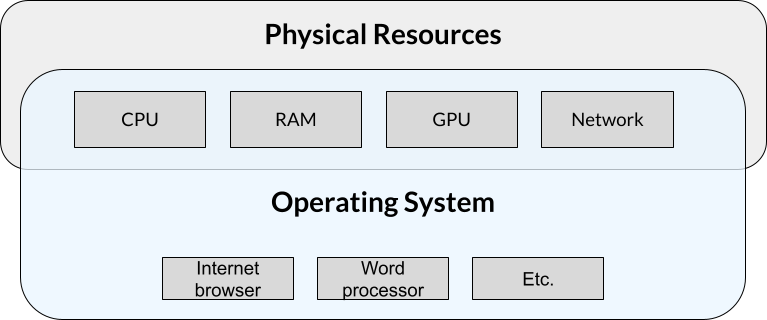
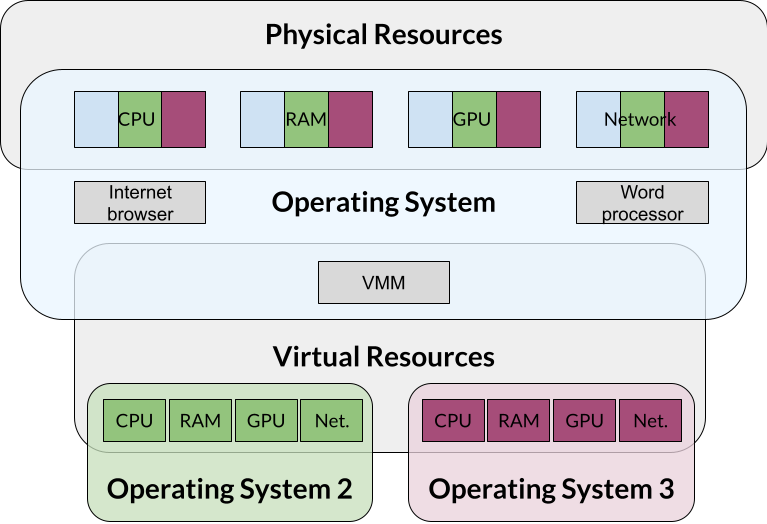

<!-- required section -->
:::::::::::::::::::::::::::::::::::::: questions 

- What are virtual machines and containers?
- How are they used in open science?

::::::::::::::::::::::::::::::::::::::::::::::::

<!-- required section -->
::::::::::::::::::::::::::::::::::::: objectives

- Explain the main components of a virtual machine and a container and list the major differences between them
- Explain at a conceptual level how these tools can be used in research workflows to enable open and reproducible research

::::::::::::::::::::::::::::::::::::::::::::::::

## Introduction

You might have heard of containers and virtual machines in various contexts. For example, you might have heard of 'containerizing' an application, running an application in 'Docker', 'spinning up' a virtual machine in order to run a certain program.

This lesson is intended to provide a hands-on primer to both virtual machines and containers. We will begin with a conceptual overview. We will follow it by hands-on explorations of two tools: VirtualBox and Docker.

If you forget what a particular term means, refer to the [Glossary](reference.html).

:::::::::::::::::::::::prereq
This lesson assumes no prior experience with containers or virtual machines. However, it does assume basic knowledge about computer and networking concepts. These include

- Ability to install software (and obtaining elevated/administrative rights to do so), 
- Basic knowledge of the components of a computer and what they do (CPU, network, storage)
- Knowledge of how to navigate your computer's directory structure (either graphically or via the command line).

Prior exposure to using command line tools is useful but not required.
:::::::::::::::::::::::

## What are virtual machines and what do they do?

We're all familiar with computers like Macs and PCs. They run an operating system like Windows or Mac, and we can run programs on that computer like web browsers and word processors. The operating ssystem controls all of the physical resources.

{alt='diagram showing boxes with hardware resources, applications, and the operating system'}

Normally, computers run a single operating system with a single set of applications. Sometimes (for reasons we'll discuss soon), people might want to run a totally separate operating system with a different set of applications. One way to do that is to split up the physical resources like CPU, RAM, etc. and share them with that second operating system. The concept of "virtualizing" these resources to share and separate them so that only this second operating system can access them is the idea behind a virtual machine.

At its core, a virtual machine is a complete set of operating system, application, and any other needed files needed that runs on hardware resources shared (i.e., virtualized) by the host operating system. 

{alt='diagram showing boxes with hardware resources, applications, the operating system, and how virtualization shares resources'}

:::::::::::::::::::::::::::::::::::::callout

One way to think of the concept is that a virtual machine is a computer that runs inside your computer. This mini computer is completely separated from the main computer. 

::::::::::::::::::::::::::::::::::::

Why would we want to 


## What are containers and what do they do?


## Comparing virtual machines and containers


::::::::::::::::::::::::::::::::::::: keypoints 

- A virtual machine is a separate computer that runs with its own operating system and applications inside of a host operating system
- A virtual machine manager handles the sharing of resources and execution of the virtual machine itself.

::::::::::::::::::::::::::::::::::::::::::::::::

<!--
:::::::::::::::::::::::::::::::::::::::::::::::::::::::::::::::::::: instructor

Inline instructor notes can help inform instructors of timing challenges
associated with the lessons. They appear in the "Instructor View"

::::::::::::::::::::::::::::::::::::::::::::::::::::::::::::::::::::::::::::::::

::::::::::::::::::::::::::::::::::::: challenge 

## Challenge 1: Can you do it?

What is the output of this command?

```r
paste("This", "new", "lesson", "looks", "good")
```

:::::::::::::::::::::::: solution 

## Output
 
```output
[1] "This new lesson looks good"
```

:::::::::::::::::::::::::::::::::


## Challenge 2: how do you nest solutions within challenge blocks?

:::::::::::::::::::::::: solution 

You can add a line with at least three colons and a `solution` tag.

:::::::::::::::::::::::::::::::::
::::::::::::::::::::::::::::::::::::::::::::::::

## Figures

You can use standard markdown for static figures with the following syntax:

`{alt='alt text for
accessibility purposes'}`

{alt='Blue Carpentries hex person logo with no text.'}

::::::::::::::::::::::::::::::::::::: callout

Callout sections can highlight information.

They are sometimes used to emphasise particularly important points
but are also used in some lessons to present "asides": 
content that is not central to the narrative of the lesson,
e.g. by providing the answer to a commonly-asked question.

::::::::::::::::::::::::::::::::::::::::::::::::


## Math

One of our episodes contains $\LaTeX$ equations when describing how to create
dynamic reports with {knitr}, so we now use mathjax to describe this:

`$\alpha = \dfrac{1}{(1 - \beta)^2}$` becomes: $\alpha = \dfrac{1}{(1 - \beta)^2}$

Cool, right?

::::::::::::::::::::::::::::::::::::: keypoints 

- Use `.md` files for episodes when you want static content
- Use `.Rmd` files for episodes when you need to generate output
- Run `sandpaper::check_lesson()` to identify any issues with your lesson
- Run `sandpaper::build_lesson()` to preview your lesson locally

::::::::::::::::::::::::::::::::::::::::::::::::

[r-markdown]: https://rmarkdown.rstudio.com/
-->
