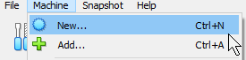
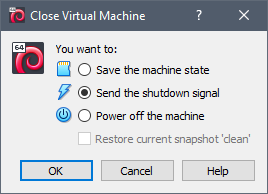
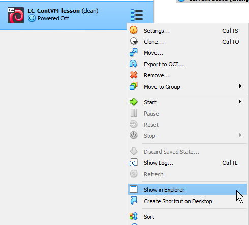

## Data Sets

We will be using a prebuilt virtual machine that already contains most things needed to get started.  Download the correct Zip file to your system but do not do anything else with it at the moment. We will import it as part of the [virtual machines](virtualmachines.html) episode.

* [Download](#) if you have a Windows or Intel-based Mac
* [Download](#) if you have an ARM-based Mac

::::::::::::::::::::::::::::: instructor

This lesson will use a virtual machine for both the virtual machine AND container episodes. Instructors will be responsible for creating these virtual machine images and distributing them to students.

### Building
For compatibility with both x86-64 and ARM architectures, we will use the standard Debian distribution to base our virutal machine images on. 

Two VirtualBox images need to be built one for x86-64 (i.e., Windows and Intel-based Mac) and one for ARM64 (Apple M1, M2). 

First, decide which image you want to build

- x86-64 architecture (labeled as [x64])
- ARM64 architecture (labeled as [arm])

**You will need a machine with the appropriate architecture to build the corresponding image, and an internet connection** 

Then proceed with the steps below, following specific instructions for your specific architecture ([x64] or [arm]).

1. [Download](https://www.virtualbox.org/wiki/Linux_Downloads) and install VirtualBox 7.1 or greater for your operating system (pick one below)
    - Windows: download the distribution for Windows Hosts [x64]
    - Intel Mac: download the distribution for macOS / Intel Hosts [x64]
    - Linux: download the Linux distribution (or install from your package manager)[x64]
    - M1, M2, etc Mac: download the distribution for macOS / Apple Silicon Hosts [arm]
1. [Download](https://www.debian.org/distrib/netinst) the appropriate Debian base distribution from the Small CDs or USB Sticks section (pick one below)
    - [AMD64](https://cdimage.debian.org/debian-cd/current/amd64/iso-cd/debian-12.9.0-amd64-netinst.iso) [x64]
    - [ARM64](https://cdimage.debian.org/debian-cd/current/arm64/iso-cd/debian-12.9.0-arm64-netinst.iso) [arm]
1. Launch VirtualBox, accept all messages, and create a new virtual machine 
1. Select the downloaded file in the Create Virtual Machine wizard. The wizard should detect the distribution inside and enable the option for unattended install.
1. Leave all the options at their defaults and follow the wizard to do an unattended install. 
1. Once the installation finishes, you should see a terminal prompt. 
    - Log in with username `vboxuser` and password `changeme`
1. Install XFCE (the graphical user interface we will use) and Docker. Type the following on the command prompt
    - `su root` (when prompted, enter the password from above)
    - `apt update`
    - `apt install git curl`
    - `git clone https://github.com/coonrad/Debian-Xfce4-Minimal-Install.git`
    - `cd Debian-Xfce4-Minimal-Install`
    - `./xfce-install.sh`
    - `curl -fsSL https://get.docker.com -o get-docker.sh`
    - `sh get-docker.sh`
    - `systemctl reboot`
1. After the virtual machine reboots, a graphical login window should appear.
1. Log in with the same username and password as above
1. Test Docker installation. From the graphical desktop, open a terminal window and type
    - `sudo docker ps` (type in the same password from before if prompted)
1. You should see output that starts with `CONTAINER ID...`
1. If Firefox is not installed (check by typing `firefox` at the command prompt).
    - `sudo apt install firefox-esr`
1. Turn off the virtual machine
    - Click the 'x' at the top right of the VirtualBox window
    - Select the option 'Send the shutdown signal'
    - 
1. Package up the virtual machine for distribution
    - Open the virtual machine files on your file system by selecting Show in Explorer. Note that the text may appear differently depending on your host operating system. E.g. on Mac, it will say Show in Finder.
    - 
    - Select the .vbox file, the .vdi file (and for [arm] only, the .nvram file) and copy them to another folder on your system.
    - [arm] only: open the .vbox file in a text editor and look for the line that starts with `<NVRAM path=`.
    - [arm] only: ensure that the path to the NVRAM file is set to the file name of the NVRAM file you copied, without any path. Save the file.
    - Create a Zip file with the files.
1. Repeat this entire process to create a virtual machine for the other architecture. 

### Hosting
The files can be hosted on any online file sharing service with sufficient space like Box, Google Drive, DropBox, etc. 

If there are many learners, remain mindful of any bandwidth limits. For example, Google Drive may cut off access to publicly shared files that exceed a certain amount of transferred data within a certain time period. Therefore, you may wish to host the file on two different services or accounts.

:::::::::::::::::::::::::::::

## Software Setup

::::::::::::::::::::::::::::::::::::::: discussion

### VirtualBox

VirtualBox is the software we will be using for this lesson. Your computer must meet these requirements:

- A recent Intel or AMD CPU 
- Windows, Linux, or MacOS (see the sections below for additional information).
- Administrative access
- 8 GB of total memory
- 7 GB of free disk space

Most laptops that are newer than 5-6 years should work.

The prebuilt virtual machine image you downloaded previously contains a preconfigured Docker installation which will be used for the containers portion of the lesson.

:::::::::::::::::::::::::::::::::::::::::::::::::::

:::::::::::::::: spoiler

### Windows

Although VirtualBox runs under older version of Windows, at least **Windows 10 v1803** is needed to minimize the chance for conflicts if there is other virtualization software installed (e.g., Hyper-V). 

- On the [downloads page](https://www.virtualbox.org/wiki/Downloads) under the VirtualBox Platform Packages section, select Windows hosts.
- Install the downloaded package.

During installation, you may get warnings about missing Python core / win32api dependencies. You may safely ignore this warning as it relates to scripting VirtuaBox with Python which we will not be doing. 

::::::::::::::::::::::::

:::::::::::::::: spoiler

### MacOS

There are different download packages depending if you have an Intel Mac or an 
If you have a Mac with an Intel CPU or an Apple Arm CPU (M1, M2, or M3).

- Intel Macs: On the [downloads page](https://www.virtualbox.org/wiki/Downloads) under the VirtualBox Platform Packages section, select MacOS / Intel hosts
- Apple M1, M2, or M3: [downloads page](https://www.virtualbox.org/wiki/Downloads) under the VirtualBox Platform Packages section, select MacOS / Apple Silicon hosts. This version is new and may not work for you.

Install the downloaded package. Upon first run, you will need to grant the various system permissions it asks you for.

If VirtualBox crashes on startup, even after granting permissions (may happen for Apple Silicon hosts), you may not be able to follow the virtual machines portion of the lesson. You may wish to install Docker [directly on your machine](https://www.cprime.com/resources/blog/docker-for-mac-with-homebrew-a-step-by-step-tutorial/) if you would still like to follow the containers portion of the lesson. 

::::::::::::::::::::::::

:::::::::::::::: spoiler

### Linux

We recommend installing VirtualBox from your distribution's package manager. If the version that comes with your distribution is different than the version used in this lesson, the screenshots might differ. If you wish to install the latest version, follow the [instructions](https://www.virtualbox.org/wiki/Linux_Downloads) for your distribution.

::::::::::::::::::::::::

