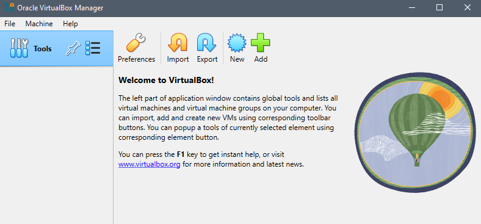
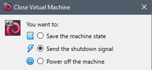

:::::::::::::::::::::::::::::::::::::: questions 

- How do you import and launch a VM using VirtualBox?
- How do you accomplish common tasks?
- How and why do you change settings for a VM?

::::::::::::::::::::::::::::::::::::::::::::::::

::::::::::::::::::::::::::::::::::::: objectives

- Explain how to navigate the VirtualBox interface
- Demonstrate how to run a VM
- Explore managing resources
- Show how to take advantage of snapshots

::::::::::::::::::::::::::::::::::::::::::::::::

## Introduction

Let's now turn to exploring how to use VMs. There are [many choices](https://en.wikipedia.org/wiki/Comparison_of_platform_virtualization_software) for running VMs, each with their own strengths and weaknesses. The ones you may encounter more often are the VMWare family of products, Hyper-V which is included with Windows, Parallels which is a product for MacOS, and VirtualBox which is owned by Oracle Corporation and is cross-platform and open-source.

As part of the [setup](index.html), you should have already have VirtualBox installed and running on your system before continuing.

## Running the example VM

::::::::::::::::::::::: instructor

Learners may be prompted to use the Basic or Expert interface when VirutalBox is run for the first time. Learners should select Basic.

If learners already ran VirtualBox and selected Expert, make sure students know what they see may not be exactly what is on your screen. They can switch back to Basic by going to the File menu, selecting Preferences, and clicking the Basic tab in the top left-hand corner of the dialog.

If there are other issues running the VM on Windows, refer to the [setup](index.html). There is an instructor note under the Windows section.

::::::::::::::::::::::: 

First, run VirtualBox. Depending on your operating system and exact system configuration, you may get different popups asking for certain permissions or showing you some notifications. Grant all the permissions it asks for and close any popups (if the popup shows an error, ask the instructor for help). You may also get a question asking whether you want to use the "basic" or "expert" interface (choose basic).

You should see a window that resembles this:



Now, let's import the VM you downloaded previously

- Extract the Zip file you downloaded into a folder somewhere on your system.
- In VirtualBox, click the big green '+ Add' button
- In the popup, locate the extracted folder and open the .vbox file (on Windows, this file has a blue icon).
- After doing so, a new entry will appear in VirtualBox underneath the Tools row in the left-hand sidebar.

Start the VM

- Select the imported VM if it isn't selected already
- Click the green "-> Start" button
- Accept any additional dialogs that pop up (if any)
- A new window will appear that shows some commands being run, followed by a graphical desktop. If prompted for a login, enter `vboxuser` and `changeme`.

::::::::::::::::::::::::::::::::::::: callout

Look for and open the web browser in the VM. What do you notice about interacting with stuff inside the VM? How is it different or the same than your normal computer?

::::::::::::::::::::::::::::::::::::


::::::::::::::::::::::: instructor

If students get an error opening VirtualBox or importing the VM, there may be something you can do (reinstalling, rebooting, checking there is enough disk space, making sure they are not trying to import directly from inside the Zip). 

If they have an error trying to run the VM, there is less you can do. Some things to try would be tinkering with the VM settings under the System or Display categories

- Making sure they downloaded the right VM for their system
- Reducing the base memory
- Playing with the Paravirtualization Interface choice under the Acceleration tab (expert mode must be selected at the top of the settings for the tab to appear).
- Increasing the video memory

If none of that works, there is nothing else you can do and they will have to pair up with someone that has it working. 

::::::::::::::::::::::: 


## Common tasks

### Shutting down the VM

To properly turn off the VM, use the functionality built into the guest OS. In our case, go to Applications in the top right corner and look for the log out icon at the bottom of the popup menu. Click it and see the red Shut Down button.

(Don't actually shut down the system)


::::::::::::::::::::::::::::::::: challenge
## Challenge 1: 

Another way to turn off the VM is to close the window the VM is running in. On Windows, click the 'X' at the top right corner of the VM window. You should see a popup that's similar to this.



What do you think the difference is between the "Send the shutdown signal" option and the "Power off the machine" option?


:::::::::::::::::::::::: solution 

The "power off the machine option" is the equivalent of ripping out the power cable from the wall. It will immediately terminate the VM without trying to gracefully allow the guest OS to shut down. This might result in data loss or even render the machine unbootable. "Send the shutdown signal" will try to indicate to the guest OS that it is time to shut down (equivalent clicking Shut Down in the guest OS) . Not all guests can be cleanly shut down this way.

:::::::::::::::::::::::::::::::::
:::::::::::::::::::::::::::::::::::::

### Saving execution states

A very useful feature of VMs is the ability to save snapshots of the current state of the VM at any point. This can be used to

- Turn off the VM and go back to it later with everything still open and running. Equivalent to walking away from your computer and coming back later
- Preserve the state of the OS or an application before doing system updates
- If you're experimenting, to be able to easily return to a 'clean' state

Let's see snapshots in action. 

- In your VM, open up a few windows and applications. 
- Click the button to close the VM as shown in Challenge 1. 
- Select the "Save the machine state" option.

The VM will close. In VirtualBox, start the VM again. You should see the same windows you opened before.

You can also take more than one snapshot. To do so, go to VirtuaBox, select the VM, and click the Take button. These snapshots act like checkpoints and you can go back to any of them at any time.


To restore a snapshot, right-click on it and select "Restore".

::::::::::::::::::::::::::::::::: challenge
## Challenge 2: 

What if we're done with a snapshot and don't want it anymore? Delete the snapshot we created, Snapshot 1. What is the result if you boot up the VM again?


:::::::::::::::::::::::: solution 

The VM should look exactly the same as before you deleted the snapshot. The difference is that you will no longer be able to go back to the state that was stored in the snapshot.

:::::::::::::::::::::::::::::::::
:::::::::::::::::::::::::::::::::::::


## Managing VM Resources

Recall that VMs share the resources of the host OS. These resources can be managed on a per-VM basis.

Right-click the VM and select Settings. You should see a window that looks like this:


There are various sections that can be modified. Note that changing some of these after a guest OS is installed may break it. However, some are safe to change. The ones that are safe generally correspond to things that can be upgraded in a normal computer (e.g., memory, number of monitors).

::::::::::::::::::::::::::::::::: challenge
## Challenge 3: 

Increase the RAM available to the VM to 2 GB (2048 MB). Verify it by running this command inside a terminal window

```
cat /proc/meminfo | grep MemTotal
```

What is the output of that command? What should be the effect on the VM's performance?


:::::::::::::::::::::::: solution 

You should see `2014504 kB`. Performance should increase, especially when applications are loading a lot of data into memory. Web browsers are especially heavy memory users.

To see the memory usage within the graphical interface of the guest OS, click Applications -> About Xfce. The memory is shown on the System tab. Note this is specific to this installation of the guest OS.

:::::::::::::::::::::::::::::::::


:::::::::::::::::::::::::::::::::::::


::::::::::::::::::::::::::::::::::::: keypoints 

- The same VM can be copied and run on different computers
- The execution state of VMs can be saved and restored at any time. 
- VM resources (e.g., CPUs, memory) can be changed, even after the VM is created. This allows controlling how much resources the VM can consume. 

::::::::::::::::::::::::::::::::::::::::::::::::

